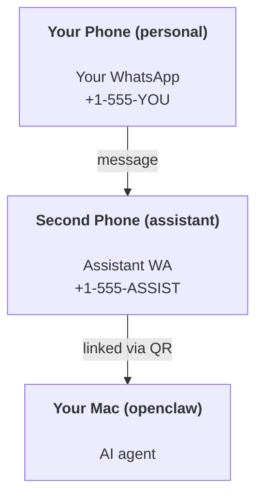

# 思思深夜探索日志

> 守护进程自动记录
> 开始时间：2026-04-18 00:30
> 状态：运行中

---

# 第 1 轮探索 — Sun Apr 19 00:09:11 CST 2026

## 2026-04-19 00:09 — OpenClaw 架构探索
阅读: /app/docs/start/openclaw.md
---
summary: "End-to-end guide for running OpenClaw as a personal assistant with safety cautions"
read_when:
  - Onboarding a new assistant instance
  - Reviewing safety/permission implications
title: "Personal Assistant Setup"
---

# Building a personal assistant with OpenClaw

OpenClaw is a self-hosted gateway that connects Discord, Google Chat, iMessage, Matrix, Microsoft Teams, Signal, Slack, Telegram, WhatsApp, Zalo, and more to AI agents. This guide covers the "personal assistant" setup: a dedicated WhatsApp number that behaves like your always-on AI assistant.

## ⚠️ Safety first

You’re putting an agent in a position to:

- run commands on your machine (depending on your tool policy)
- read/write files in your workspace
- send messages back out via WhatsApp/Telegram/Discord/Mattermost and other bundled channels

Start conservative:

- Always set `channels.whatsapp.allowFrom` (never run open-to-the-world on your personal Mac).
- Use a dedicated WhatsApp number for the assistant.
- Heartbeats now default to every 30 minutes. Disable until you trust the setup by setting `agents.defaults.heartbeat.every: "0m"`.

## Prerequisites

- OpenClaw installed and onboarded — see [Getting Started](/start/getting-started) if you haven't done this yet
- A second phone number (SIM/eSIM/prepaid) for the assistant

## The two-phone setup (recommended)

You want this:



If you link your personal WhatsApp to OpenClaw, every message to you becomes “agent input”. That’s rarely what you want.

## 5-minute quick start

1. Pair WhatsApp Web (shows QR; scan with the assistant phone):

```bash
openclaw channels login
```

阅读: /app/docs/gateway/openshell.md
---
title: OpenShell
summary: "Use OpenShell as a managed sandbox backend for OpenClaw agents"
read_when:
  - You want cloud-managed sandboxes instead of local Docker
  - You are setting up the OpenShell plugin
  - You need to choose between mirror and remote workspace modes
---

# OpenShell

OpenShell is a managed sandbox backend for OpenClaw. Instead of running Docker
containers locally, OpenClaw delegates sandbox lifecycle to the `openshell` CLI,
which provisions remote environments with SSH-based command execution.

The OpenShell plugin reuses the same core SSH transport and remote filesystem
bridge as the generic [SSH backend](/gateway/sandboxing#ssh-backend). It adds
OpenShell-specific lifecycle (`sandbox create/get/delete`, `sandbox ssh-config`)
and an optional `mirror` workspace mode.

## Prerequisites

- The `openshell` CLI installed and on `PATH` (or set a custom path via
  `plugins.entries.openshell.config.command`)
- An OpenShell account with sandbox access
- OpenClaw Gateway running on the host

## Quick start

1. Enable the plugin and set the sandbox backend:

```json5
{
  agents: {
    defaults: {
      sandbox: {
        mode: "all",
        backend: "openshell",
        scope: "session",
        workspaceAccess: "rw",
      },
    },
  },
  plugins: {
    entries: {
      openshell: {
        enabled: true,
        config: {
          from: "openclaw",
          mode: "remote",

OpenClaw 文档阅读完成
